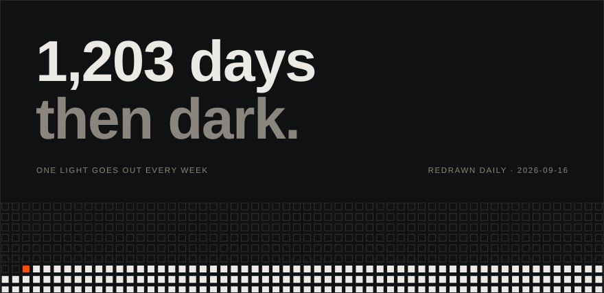

# terminus

One light goes out every week.

**[watch it happen](https://retrocodes12.github.io/terminus/)**

what is this

 

The wall is the 522 weeks of the 2020s — 58 across, 9 down. Lit cells are
weeks that haven't happened yet. The orange cell is the week you are in.
The lights have been going out since 1 January 2020 and the last one dies
at 00:00 UTC, 1 January 2030.

On [the page](https://retrocodes12.github.io/terminus/), point at any light
and it tells you which week it was, the dates it covers, and how far out it
is. Arrow keys work too.

- [`generate.mjs`](generate.mjs) draws the SVG. No dependencies. The type is
  Archivo Expanded, embedded in the SVG as a woff2 data URI so GitHub's
  sandboxed image proxy still renders it.
- [A workflow](.github/workflows/tick.yml) redraws the wall every day at
  00:17 UTC and commits. The commit log is the countdown.
- [The page](https://retrocodes12.github.io/terminus/) is the same wall,
  ticking live.

The decade divides into weeks exactly once: 522 = 58 × 9. It does not divide
evenly into the weeks themselves — 3,653 days is 521 weeks and a remainder, so
the last cell is a six-day week. Time does not care about grids.

Type: [Archivo](https://fonts.google.com/specimen/Archivo) by Omnibus-Type,
SIL Open Font License 1.1.

